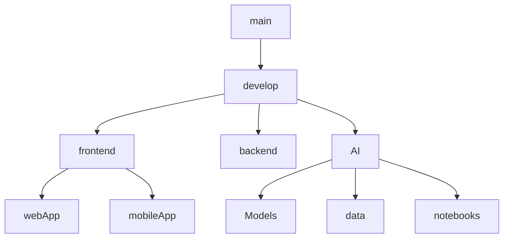

# Human_Aid
Our system is designed to support individuals with dyslexia by improving their reading and writing skills through innovative, user-friendly solutions. By leveraging interactive tools and accessibility-focused design, we aim to make learning more engaging and effective for those with reading challenges.

#Project Structure




# Contribution Guide

Welcome to the repository! This document outlines the process for contributing to the project, including guidelines for creating branches, pushing code, and performing code reviews. Please read this carefully before contributing.

---

## **Git Workflow**

1. **Clone the Repository**
   - Use the following command to clone the repository:  
     ```bash
     git clone <repository-url>
     ```
   - Navigate into the project directory:  
     ```bash
     cd <repository-folder>
     ```

2. **Create a Feature Branch**
   - Always work in a feature branch. **Do not work directly in the `main` or `master` branch.**
   - Name the branch according to the feature or fix you are working on:
     ```bash
     git checkout -b <feature-name>
     ```
     Examples:
     - `feature/add-login-page`
     - `bugfix/fix-login-error`
     - `improvement/refactor-api-endpoints`

3. **Write Clean, Modular Code**
   - Follow the project's coding standards and guidelines (refer to `CONTRIBUTING.md` if available).
   - Ensure your code is documented where necessary.

4. **Push Your Changes**
   - Commit your changes with meaningful commit messages:
     ```bash
     git add .
     git commit -m "Short description of the changes"
     ```
   - Push the changes to the remote branch:
     ```bash
     git push origin <branch-name>
     ```

---

## **Code Review Process**

1. **Create a Pull Request (PR)**
   - Once your feature or fix is complete, create a pull request to merge your branch into the `main` or the relevant base branch.
   - Go to the repository on GitHub and click `New Pull Request`.
   - Provide a clear and concise description of the changes in the PR template.

2. **Assign a Reviewer**
   - Assign a team member as the code reviewer for your PR.
   - Ensure the reviewer is familiar with the section of code you're modifying.

3. **Review and Feedback**
   - The reviewer will examine your code for correctness, readability, and adherence to project guidelines.
   - If feedback is provided, address the comments and make the necessary changes.

4. **Approval and Merge**
   - Once the reviewer approves your PR, you can merge it into the base branch.
   - Use **squash and merge** to ensure a clean commit history.

---

## **Additional Guidelines**

1. **Testing**
   - Write unit and integration tests for your code changes.
   - Ensure all tests pass before pushing your changes.

2. **Documentation**
   - Update relevant documentation (e.g., `README.md`, API docs, or code comments) to reflect your changes.

3. **Sync with the Base Branch**
   - Periodically sync your branch with the latest changes from the base branch to avoid merge conflicts:
     ```bash
     git fetch origin
     git merge origin/main
     ```

4. **Handle Conflicts**
   - If a merge conflict arises, resolve it locally before pushing the updates.

5. **Branch Deletion**
   - After merging your branch, delete it to keep the repository clean:
     ```bash
     git branch -d <branch-name>
     ```

---

## **Contact**
If you have questions about the workflow or encounter issues, please contact the repository maintainer.

Happy coding! 🚀
