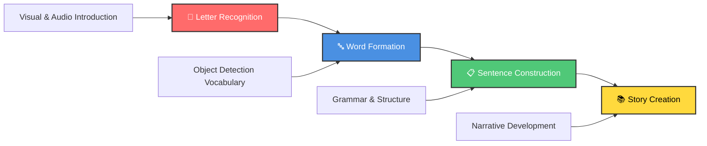

# 🌟 LEXFIX: Arabic Learning App for Dyslexic Students


<div align="center">

<!-- App Logo -->


**A comprehensive mobile application designed to support Arabic language learning for students with dyslexia through visual aids, interactive activities, and personalized learning experiences.**


</div>


---

## 📥 Download Links

<div align="center">

### 🔗 **Direct Download**
👉 **[Click here to download the app](https://ibrahimm0stafa.github.io/LexFix/)**

### 📱 **Scan QR Code**


</div>

---

## 🎯 **Key Highlights**

<table>
<tr>
<td width="50%">

### 🧠 **Dyslexia-Specialized**
- Visual aids & color coding
- Expert-backed methodology
- Adaptive learning paths
- Multisensory approach

</td>
<td width="50%">

### 🤖 **AI-Enhanced Learning**
- Text-to-Speech integration
- Voice recognition technology
- Object detection capabilities
- Personalized story generation

</td>
</tr>
</table>

---

## 🌟 **Features Overview**

### 🎓 Core Learning System

<details>
<summary><strong>Click to expand Core Learning features</strong></summary>

#### 🎨 **Dyslexia-Friendly Design**
Visual aids, color coding, and tailored difficulty levels specifically designed for dyslexic learners.

#### 📈 **Gradual Learning Paradigm** 
Progressive learning journey: `Letters` → `Words` → `Sentences` → `Stories`
- Orchestrated by backend APIs for structured lesson delivery
- Real-time progress tracking and user advancement monitoring

#### 🎮 **Interactive Multisensory Activities**
Engaging games and activities following each lesson:
- Backend endpoints evaluate user input
- Provide real-time feedback and corrections
- Adaptive difficulty based on performance

#### 👨‍⚕️ **Expert-Backed Approach**
Developed with insights from:
- Psychologists specializing in dyslexia
- Educational specialists
- Backend support for storing expert recommendations

</details>

### 🚀 Advanced Technology Integration

<div align="center">

| Feature | Description | Backend Integration |
|---------|-------------|-------------------|
| 🔊 **Text-to-Speech** | Reading & auditory support for all content | TTS services integration |
| 🎤 **Speech-to-Text** | Voice interaction & pronunciation evaluation | Audio processing & scoring |
| 📷 **Object Detection** | Real-life vocabulary learning through camera | AI-based image recognition |
| 📚 **AI Story Generation** | Personalized stories based on preferences | Advanced language models |
| 📝 **Story Summarization** | Comprehension assessment tools | Extractive AI summarization |

</div>

---

## 📱 **App Screenshots**


<div align="center">

<table>
<tr>
<td align="center">

<br><em>📊 Main Dashboard</em>
<br><small>Learning progress & available activities</small>
</td>
<td align="center">

<br><em>🎨 Learning Interface</em>
<br><small>Interactive lessons with visual aids</small>
</td>
<td align="center">

<br><em>🎮 Games Section</em>
<br><small>Multisensory activities & games</small>
</td>
</tr>
<tr>


<td align="center">

<br><em>📷 Object Detection</em>
<br><small>Real-time vocabulary learning</small>
</td>
<td align="center">

<br><em>📈 Progress Tracking</em>
<br><small>Detailed analytics & achievements</small>
</td>
<td align="center">

<br><em>🔊 Voice Features</em>
<br><small>Speech recognition & TTS</small>
</td>
</tr>
</table>

</div>

---

## 🎥 **Demo Videos**

<div align="center">

<table>
<tr>
<td align="center" width="33%">
<a href="videos/app-demo.mp4">

</a>
<br><strong>🎬 Complete App Walkthrough</strong>
<br><em>Full feature demonstration</em>
</td>
<td align="center" width="33%">
<a href="videos/learning-flow.mp4">

</a>
<br><strong>📚 Learning Process</strong>
<br><em>Letters to stories progression</em>
</td>
<td align="center" width="33%">
<a href="videos/voice-features.mp4">

</a>
<br><strong>🎤 Voice Capabilities</strong>
<br><em>TTS & STT in action</em>
</td>
</tr>
</table>

</div>

---

---

## 🏗️ **Backend Architecture & Database**

<div align="center">

### 🏛️ **Backend Server Architecture**


*Comprehensive backend architecture showing API, services, and data flow*


### 🗄️ **MongoDB Database**


*Entity Relationship Diagram showing MongoDB database*


</div>

## 👥 **User Roles & Access**

<div align="center">

<table>
<tr>
<td width="50%" align="center">

### 🧑‍🎓 **Independent Learner**


- 📝 Individual registration & app usage
- 📊 Personal progress tracking with analytics
- 🎯 Self-paced learning experience
- 🤖 Backend API-driven content adaptation

**Features:**
- ✅ Complete learning modules
- ✅ Interactive games & activities  
- ✅ Voice & object detection tools
- ✅ AI-generated stories

</td>
<td width="50%" align="center">

### 👨‍👩‍👧‍👦 **Guardian Account**


- 👶 Manage up to **3 children** under supervision
- 📈 Access detailed performance reports
- 📧 Automated PDF reports via email
- 🎯 Monitor learning progress & achievements

**Features:**
- ✅ Multi-child account management
- ✅ Performance analytics dashboard
- ✅ Progress reports & insights
- ✅ Email notifications & updates

</td>
</tr>
</table>

</div>

---

## 🔐 **Security & Authentication**

<div align="center">

| Security Feature | Implementation | Backend Integration |
|------------------|----------------|-------------------|
| 🔒 **Secure Authentication** | JWT-based system | Encrypted password storage |
| 👤 **Role-Based Access** | Learner/Guardian/Admin roles | Middleware enforcement |
| 🛡️ **Data Protection** | GDPR compliance | Secure session management |
| 🔐 **Privacy Controls** | Data encryption | Validation & security protocols |

</div>

---

## 🎓 **Learning Structure**

### 📈 **Progressive Learning Path**



<details>
<summary><strong>📖 Detailed Learning Stages</strong></summary>

#### 1️⃣ **Letter Recognition**
- 👁️ Visual and auditory letter introduction
- 📊 Backend tracking of attempts and accuracy
- 🎯 Adaptive difficulty based on performance

#### 2️⃣ **Word Formation** 
- 🏗️ Building vocabulary with object detection
- 🗣️ Backend evaluation of spoken input
- 👁️ Visual association learning

#### 3️⃣ **Sentence Construction**
- 📝 Grammar and structure learning
- 🔊 Backend scoring of pronunciation
- ✅ Sentence formation evaluation

#### 4️⃣ **Story Creation**
- 📚 Narrative skills development
- 🤖 Backend AI story generation
- 📋 Comprehension summarization

</details>

### 🎮 **Interactive Activities**

<div align="center">

| Activity Type | Features | Backend Processing |
|---------------|----------|-------------------|
| 🎯 **Multisensory Games** | Post-lesson activities | Game controllers & feedback |
| 🗣️ **Pronunciation Practice** | Multi-level evaluation | Speech-to-text scoring |
| ⚡ **Real-time Feedback** | Instant corrections | Backend endpoint responses |
| 📈 **Adaptive Difficulty** | Performance-based adjustment | Analytics-driven content |

</div>

---

## 🤖 **AI-Powered Features**

<div align="center">

<table>
<tr>
<td align="center" width="33%">

### 📚 **Story Generation**


- 🎨 Personalized story creation
- 🤖 Language model integration  
- ❓ Interactive comprehension questions
- 📊 Assessment & evaluation tools

</td>
<td align="center" width="33%">

### 📷 **Object Detection**


- 📸 Real-time object recognition
- 🔗 Vocabulary building through visuals
- 📱 Camera-based learning activities
- 🗄️ Backend image processing & storage

</td>
<td align="center" width="33%">

### 🎤 **Voice Technology**


- 🗣️ Advanced Speech-to-Text
- 🔊 Natural Text-to-Speech
- 📊 Pronunciation accuracy evaluation
- 📈 Progress tracking & analytics

</td>
</tr>
</table>

</div>

---

## 📊 **Progress Tracking & Rewards**

<div align="center">

### 📈 **Performance Monitoring**

<table>
<tr>
<td width="50%">

#### 📊 **Analytics Dashboard**
- Comprehensive progress tracking
- Exercise and level progression
- Learning analytics & insights
- Performance trend analysis

</td>
<td width="50%">

#### 🎯 **Achievement System**
- Milestone tracking & goals
- Badge and point rewards
- Motivational achievements
- Progress celebrations

</td>
</tr>
</table>

### 🏆 **Gamification Elements**

| Element | Description | Backend Management |
|---------|-------------|-------------------|
| 🥇 **Badges** | Achievement unlocks | Backend achievement modules |
| ⭐ **Points** | Activity rewards | Real-time point calculation |
| 🔥 **Streaks** | Daily learning chains | Activity tracking & notifications |
| 🎖️ **Milestones** | Progress celebrations | Automated achievement detection |

</div>

---

## 📱 **Engagement Features**

<div align="center">

<table>
<tr>
<td width="50%" align="center">

### 🔔 **Smart Notifications**


- 📅 Personalized learning reminders
- 🔄 Re-engagement campaigns for inactive users  
- 🔥 Learning streak maintenance alerts
- 📧 Backend notification & email services

</td>
<td width="50%" align="center">

### 👨‍👩‍👧‍👦 **Guardian Integration**


- 📄 Automated PDF performance reports
- 📧 Email delivery to registered guardians
- 📊 Progress summaries & recommendations
- ⏰ Backend scheduled job automation

</td>
</tr>
</table>

</div>

---

## 🗄️ **Data Management**

<div align="center">

### 🔐 **Secure Database System**

| Security Layer | Implementation | Compliance |
|----------------|----------------|------------|
| 🔒 **Encryption** | User data protection | AES-256 encryption |
| 📊 **Progress Tracking** | Achievement & exercise data | Structured backend models |
| 🌍 **GDPR Compliance** | Privacy-first approach | Data handling standards |
| 💾 **Backup System** | Regular data protection | Automated backup jobs |

</div>

---

## 👨‍💼 **Admin Dashboard**

<div align="center">

<table>
<tr>
<td width="50%">

### 📊 **Analytics & Monitoring**
- Real-time user activity tracking
- Performance analytics dashboard
- System health monitoring
- Usage statistics & insights

</td>
<td width="50%">

### 🛠️ **Management Tools**
- Content management system
- User account administration
- CRUD operations for lessons & games
- System maintenance utilities

</td>
</tr>
</table>

</div>

---

## 🧠 **Expert Consultation**

<div align="center">

**The app development incorporated insights from leading specialists:**

<table>
<tr>
<td align="center" width="25%">
🧠<br><strong>Educational Psychologists</strong><br><em>Learning methodology</em>
</td>
<td align="center" width="25%">
📚<br><strong>Dyslexia Specialists</strong><br><em>Accessibility design</em>
</td>
<td align="center" width="25%">
🔤<br><strong>Arabic Educators</strong><br><em>Language expertise</em>
</td>
<td align="center" width="25%">
👶<br><strong>Child Development Experts</strong><br><em>Age-appropriate content</em>
</td>
</tr>
</table>

*Backend services store and reference expert recommendations to inform content and user support.*

</div>

---

## 🚀 **Getting Started**

<div align="center">

<table>
<tr>
<td width="50%" align="center">

### 🧑‍🎓 **For Independent Learners**

1. 📱 **Download** the app from your device's app store
2. 📝 **Create** your personal account  
3. 🎯 **Complete** the initial assessment
4. 🚀 **Begin** your Arabic learning journey

[](#)

</td>
<td width="50%" align="center">

### 👨‍👩‍👧‍👦 **For Guardians**

1. 👤 **Register** for a Guardian account
2. 👶 **Add** up to 3 children profiles
3. 🎯 **Set** learning goals and preferences  
4. 📊 **Monitor** progress through reports

[](#)

</td>
</tr>
</table>

</div>

---

## 📋 **Technical Requirements**

<div align="center">

### 💻 **System Requirements**

<table>
<tr>
<td width="50%">

#### 📱 **Minimum Requirements**
-  / 
- 🧠 **2GB RAM** minimum
- 📷 **Camera** access for object detection
- 🎤 **Microphone** for speech features
- 🌐 **Internet** for AI features

</td>
<td width="50%">

#### 🔐 **Required Permissions**
- 📷 **Camera**: Object detection & visual learning
- 🎤 **Microphone**: Speech recognition & pronunciation
- 💾 **Storage**: Offline content & progress data
- 🔔 **Notifications**: Learning reminders & updates

</td>
</tr>
</table>

</div>

---

## 🔧 **Installation & Development**

<div align="center">

### 💻 **Developer Setup**

</div>

```bash
# Clone the repository
git clone https://github.com/your-username/arabic-dyslexia-app.git

# Navigate to project directory
cd arabic-dyslexia-app

# Install dependencies
npm install

# Run the application
npm start
```

<div align="center">

[](#)
[](#)
[](#)

</div>

---

## 📄 **License**

<div align="center">


This project is licensed under the **MIT License** - see the [LICENSE](LICENSE) file for details.

</div>

---

## 📞 **Support & Contact**

<div align="center">

### 🤝 **Get Help**

<table>
<tr>
<td align="center" width="33%">
📧<br><strong>Email Support</strong><br><a href="mailto:support@arabic-dyslexia-app.com">support@arabic-dyslexia-app.com</a>
</td>
<td align="center" width="33%">
📚<br><strong>Documentation</strong><br><a href="#">Complete Guide</a>
</td>
<td align="center" width="33%">
🐛<br><strong>Report Issues</strong><br><a href="#">GitHub Issues</a>
</td>
</tr>
</table>

[](#)
[](#)

</div>

---

## 🙏 **Acknowledgments**

<div align="center">

**We extend our heartfelt gratitude to:**

<table>
<tr>
<td align="center" width="33%">
🧠<br><strong>Expert Consultants</strong><br><em>Dyslexia specialists & educators who provided invaluable insights</em>
</td>
<td align="center" width="33%">
🔤<br><strong>Language Experts</strong><br><em>Arabic language specialists ensuring cultural & linguistic accuracy</em>
</td>
<td align="center" width="33%">
👨‍👩‍👧‍👦<br><strong>Beta Testers</strong><br><em>Families who provided essential feedback during development</em>
</td>
</tr>
</table>

---

### 💝 **Made with ❤️ for dyslexic learners and their families**


</div>

---

<div align="center">

**⭐ Star this repository if you find it helpful! ⭐**

[](#)
[](#)
[](#)

</div>
