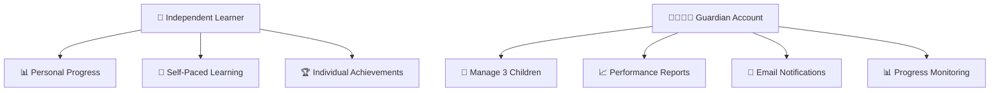

# 🌟 Arabic Learning App for Dyslexic Students

<div align="center">

[](https://apps.apple.com/app/your-app)
[](https://play.google.com/store/apps/details?id=your.app.id)
[](https://github.com/your-repo)
[](LICENSE)

**A comprehensive mobile application designed to support Arabic language learning for students with dyslexia through visual aids, interactive activities, and AI-powered personalized learning experiences.**

[📱 Download Now](#-getting-started) • [🎥 Watch Demo](#-demo-videos) • [📋 Features](#-features-overview) • [💬 Support](#-support)

</div>

---

## 📖 Table of Contents

- [🌟 Features Overview](#-features-overview)
- [📱 Screenshots & Demo](#-screenshots--demo)
- [👥 User Roles](#-user-roles)
- [🎓 Learning Structure](#-learning-structure)
- [🤖 AI-Powered Features](#-ai-powered-features)
- [📊 Progress Tracking](#-progress-tracking--rewards)
- [🚀 Getting Started](#-getting-started)
- [📋 Technical Requirements](#-technical-requirements)
- [🔧 Installation](#-installation)
- [📞 Support](#-support)

---

## 🌟 Features Overview

<table>
<tr>
<td width="50%">

### 🎯 **Core Learning System**
- 🧩 **Dyslexia-Friendly Design**  
  Visual aids, color coding, and tailored difficulty levels
- 📈 **Gradual Learning Paradigm**  
  Progressive path: Letters → Words → Sentences → Stories
- 🎮 **Interactive Multisensory Activities**  
  Games and activities with real-time feedback
- 👨‍⚕️ **Expert-Backed Approach**  
  Developed with psychologists and dyslexia specialists

</td>
<td width="50%">

### 🚀 **Advanced Technology**
- 🔊 **Text-to-Speech System**  
  Reading and auditory support for all content
- 🎤 **Speech-to-Text Integration**  
  Voice interaction and pronunciation evaluation
- 📸 **Object Detection Module**  
  Real-life object interaction for vocabulary
- 🤖 **AI Story Generation**  
  Personalized stories based on preferences

</td>
</tr>
</table>

---

## 📱 Screenshots & Demo

<div align="center">

### 📸 App Screenshots

<table>
<tr>
<td align="center" width="25%">

<br><b>📊 Dashboard</b>
<br><em>Learning progress overview</em>
</td>
<td align="center" width="25%">

<br><b>📚 Learning Interface</b>
<br><em>Interactive lessons with visual aids</em>
</td>
<td align="center" width="25%">

<br><b>🎮 Games Section</b>
<br><em>Multisensory activities</em>
</td>
<td align="center" width="25%">

<br><b>📸 Object Detection</b>
<br><em>Real-time vocabulary learning</em>
</td>
</tr>
</table>

### 🎥 Demo Videos

| Demo Type | Description | Link |
|-----------|-------------|------|
| 🎬 **Complete Walkthrough** | Full app demonstration and features | [](videos/app-demo.mp4) |
| 📚 **Learning Flow** | Step-by-step learning process | [](videos/learning-flow.mp4) |
| 🎤 **Voice Features** | Text-to-Speech and Speech-to-Text | [](videos/voice-features.mp4) |

</div>

---

## 👥 User Roles

<div align="center">



</div>

### 👤 Independent Learner
> Perfect for self-motivated students

- ✅ Individual registration and app usage
- 📊 Personal progress tracking with detailed analytics
- 🎯 Self-paced learning experience
- 🏆 Achievement system and rewards

### 👨‍👩‍👧‍👦 Guardian Account
> Ideal for parents and educators

- 👶 Manage up to **3 children** under supervision
- 📈 Access detailed **performance reports**
- 📧 Automated **PDF reports via email**
- 👁️ Monitor learning progress and achievements

---

## 🎓 Learning Structure

<div align="center">

### 📚 Progressive Learning Path

```
🔤 Letter Recognition → 📝 Word Formation → 📖 Sentence Construction → 📚 Story Creation
      ↓                    ↓                     ↓                       ↓
  Visual & Audio      Object Detection     Grammar & Structure    AI Story Generation
```

</div>

<table>
<tr>
<th>🔤 Letter Recognition</th>
<th>📝 Word Formation</th>
<th>📖 Sentence Construction</th>
<th>📚 Story Creation</th>
</tr>
<tr>
<td>
• Visual letter introduction<br>
• Audio pronunciation<br>
• Writing practice<br>
• Recognition games
</td>
<td>
• Vocabulary building<br>
• Object detection<br>
• Word association<br>
• Spelling exercises
</td>
<td>
• Grammar fundamentals<br>
• Sentence structure<br>
• Pronunciation practice<br>
• Reading comprehension
</td>
<td>
• AI-generated stories<br>
• Interactive narratives<br>
• Comprehension questions<br>
• Creative writing
</td>
</tr>
</table>

### 🎮 Interactive Activities

- 🎯 **Multisensory Games** following each lesson
- 🎤 **Pronunciation Evaluation** at multiple levels  
- ⚡ **Real-time Feedback** and correction
- 🎚️ **Adaptive Difficulty** adjustment

---

## 🤖 AI-Powered Features

<div align="center">

### 🧠 Artificial Intelligence Integration

</div>

| Feature | Description | Technology |
|---------|-------------|------------|
| 📖 **Story Generation** | Personalized stories based on user preferences | 🤖 Large Language Models |
| 📸 **Object Detection** | Real-time object recognition for vocabulary | 👁️ Computer Vision AI |
| 🎤 **Voice Technology** | Speech-to-Text and Text-to-Speech | 🗣️ Natural Language Processing |
| 📊 **Smart Analytics** | Learning pattern analysis and recommendations | 📈 Machine Learning |

---

## 📊 Progress Tracking & Rewards

<div align="center">

### 🏆 Gamification System


</div>

### 📈 Performance Monitoring
- 📊 Comprehensive progress tracking system
- 🎯 Achievement milestones and goals
- 📋 Learning analytics and insights
- 📈 Performance trend analysis

### 🎮 Engagement Features
- 🏆 **Badge System**: Earn badges for achievements
- ⭐ **Point Rewards**: Collect points for activities
- 🔥 **Learning Streaks**: Maintain daily learning habits
- 🎉 **Progress Celebrations**: Milestone rewards

### 📧 Smart Notifications
- 🔔 Personalized reminders for active users
- 📩 Re-engagement campaigns for inactive users
- 📊 Automated PDF performance reports for guardians

---

## 🚀 Getting Started

<div align="center">

### Choose Your Path

</div>

<table>
<tr>
<td width="50%">

#### 👤 **For Independent Learners**

1. 📲 **Download** the app from your app store
2. 👤 **Create** your personal account  
3. 📋 **Complete** the initial assessment
4. 🎯 **Begin** your Arabic learning journey

[](https://your-app-store-link)

</td>
<td width="50%">

#### 👨‍👩‍👧‍👦 **For Guardians**

1. 📝 **Register** for a Guardian account
2. 👶 **Add** up to 3 children profiles
3. 🎯 **Set** learning goals and preferences  
4. 📊 **Monitor** progress through reports

[](https://your-app-store-link)

</td>
</tr>
</table>

---

## 📋 Technical Requirements

### 📱 System Requirements

| Platform | Minimum Version | RAM | Storage |
|----------|----------------|-----|---------|
| 🍎 **iOS** | 12.0+ | 2GB | 1GB |
| 🤖 **Android** | 7.0+ | 2GB | 1GB |

### 🔐 Required Permissions

- 📸 **Camera**: Object detection and visual learning
- 🎤 **Microphone**: Speech recognition and pronunciation  
- 💾 **Storage**: Offline content and progress data
- 🔔 **Notifications**: Learning reminders and updates

---

## 🔧 Installation

### 📱 Mobile App Installation

Download directly from your device's app store using the badges above.

### 💻 Development Setup

```bash
# Clone the repository
git clone https://github.com/your-username/arabic-dyslexia-app.git

# Navigate to project directory
cd arabic-dyslexia-app

# Install dependencies
npm install

# Run the application
npm start
```

### 🐋 Docker Setup (Optional)

```bash
# Build and run with Docker
docker-compose up --build
```

---

## 🛡️ Security & Privacy

<div align="center">


</div>

- 🔐 **JWT-based Authentication** with encrypted password storage
- 🛡️ **Role-based Access Control** for all user types
- 📊 **GDPR-compliant Data Handling** 
- 🔄 **Regular Security Updates** and backups

---

## 👨‍💼 Admin Dashboard

### 🎛️ Management Features

- 📊 **User Analytics**: Real-time monitoring and insights
- 📝 **Content Management**: CRUD operations for lessons and games
- 📈 **Activity Tracking**: Comprehensive reporting system
- ⚙️ **System Maintenance**: Admin controls and utilities

---

## 🧠 Expert Consultation

<div align="center">

**Developed with insights from leading experts:**

</div>

| Expertise | Contribution |
|-----------|--------------|
| 👨‍⚕️ **Educational Psychologists** | Learning methodology and assessment |
| 🧠 **Dyslexia Specialists** | Specialized techniques and accommodations |
| 🗣️ **Arabic Language Educators** | Cultural and linguistic accuracy |
| 👶 **Child Development Experts** | Age-appropriate content and progression |

---

## 📊 Statistics

<div align="center">


</div>

---

## 📞 Support

<div align="center">

### 💬 Get Help

| Contact Method | Details |
|----------------|---------|
| 📧 **Email Support** | [support@arabic-dyslexia-app.com](mailto:support@arabic-dyslexia-app.com) |
| 📚 **Documentation** | [View Docs](https://docs.your-app.com) |
| 🐛 **Bug Reports** | [GitHub Issues](https://github.com/your-repo/issues) |
| 💬 **Community** | [Discord Server](https://discord.gg/your-server) |

[](mailto:support@arabic-dyslexia-app.com)

</div>

---

## 📄 License

This project is licensed under the **MIT License** - see the [LICENSE](LICENSE) file for details.

---

## 🙏 Acknowledgments

<div align="center">

**Special Thanks To:**

🎓 Dyslexia specialists and educators who provided expert consultation  
🗣️ Arabic language experts who ensured cultural and linguistic accuracy  
🧪 Beta testers and their families who provided valuable feedback  
❤️ The amazing community that supports inclusive education

</div>

---

<div align="center">

### 🌟 Star this repository if it helped you!

[](https://github.com/your-username/arabic-dyslexia-app/stargazers)
[](https://github.com/your-username/arabic-dyslexia-app/network/members)

**Made with ❤️ for dyslexic learners and their families**

[🔝 Back to Top](#-arabic-learning-app-for-dyslexic-students)

</div>
